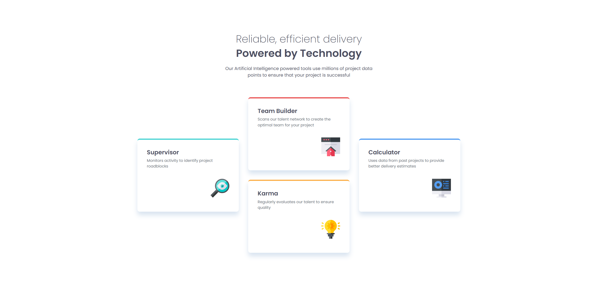

# Frontend Mentor - Four card feature section solution

This is a solution to the [Four card feature section challenge on Frontend Mentor](https://www.frontendmentor.io/challenges/four-card-feature-section-weK1eFYK). Frontend Mentor challenges help you improve your coding skills by building realistic projects.

## Table of contents

- [Overview](#overview)
  - [The challenge](#the-challenge)
  - [Screenshot](#screenshot)
  - [Links](#links)
- [My process](#my-process)
  - [Built with](#built-with)
  - [What I learned](#what-i-learned)
  - [Continued development](#continued-development)
  - [Useful resources](#useful-resources)
- [Author](#author)

## Overview

### The challenge

Users should be able to:

- View the optimal layout for the site depending on their device's screen size

### Screenshot



### Links

- Solution URL: [Solution Repository](https://github.com/LelloX-Dev/four-card-feature-section)
- Live Site URL: [Live site](https://lellox-dev.github.io/four-card-feature-section
  /)

## My process

### Built with

- Semantic HTML5
- CSS custom properties
- CSS Grid & Flexbox
- Responsive design
- Mobile-first workflow
- Google Fonts (Poppins)

### What I learned

This project helped reinforce my understanding of mobile-first design and how to combine **CSS Grid** and **Flexbox** effectively. Here's a small snippet of how I structured the responsive grid:

```css
.card-container {
  display: grid;
  grid-template-columns: 1fr;
  gap: 2rem;
}

@media (min-width: 48em) {
  .card-container {
    grid-template-columns: repeat(3, 1fr);
    grid-template-rows: repeat(2, auto);
  }
}
```

Also, I used semantic HTML and CSS variables to keep styles scalable and maintainable.

### Continued development

I'd like to improve on accessibility by incorporating ARIA roles and exploring dark mode theming with CSS custom properties. I'd also like to try recreating this layout with a modern JavaScript framework like React or Svelte.

### Useful resources

- [MDN Web Docs - CSS Grid](https://developer.mozilla.org/en-US/docs/Web/CSS/CSS_Grid_Layout)
- [CSS Tricks - A Complete Guide to Flexbox](https://css-tricks.com/snippets/css/a-guide-to-flexbox/)

## Author

- Frontend Mentor - [@LelloX-Dev](https://www.frontendmentor.io/profile/LelloX-Dev)
- Github - [@LelloX-Dev](https://github.com/LelloX-Dev)
